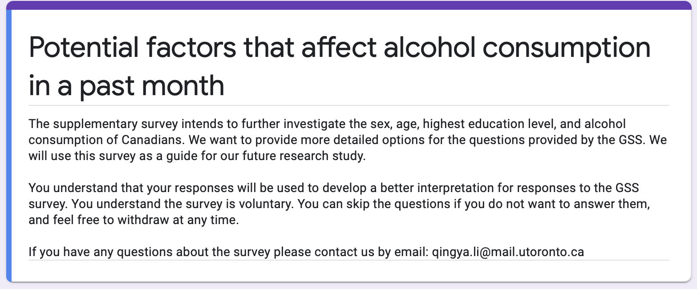
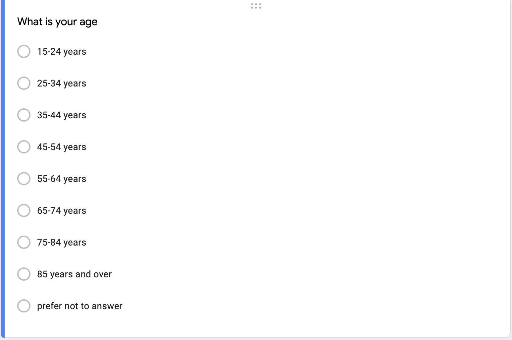
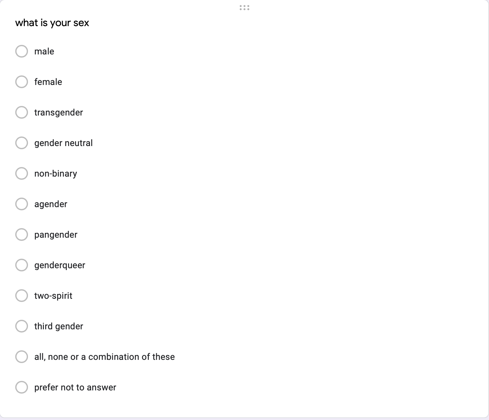
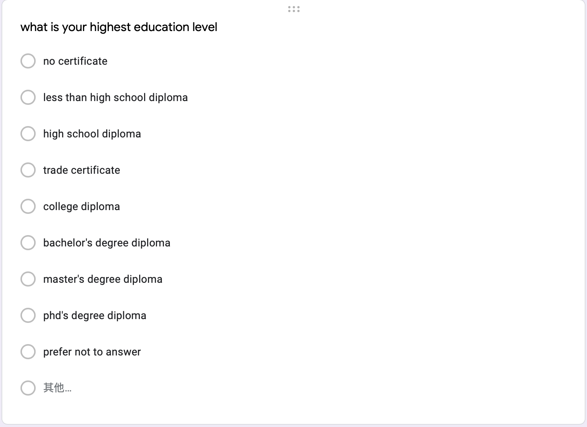
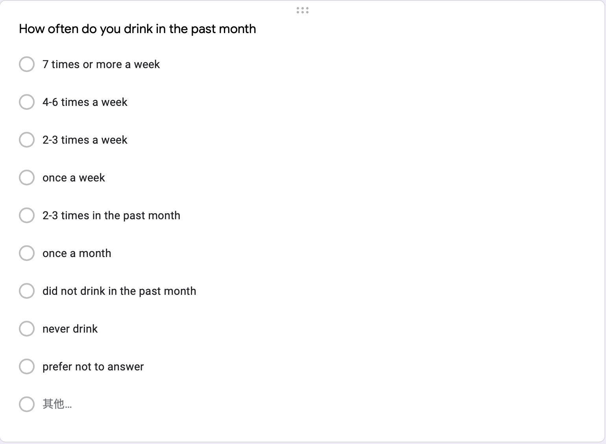
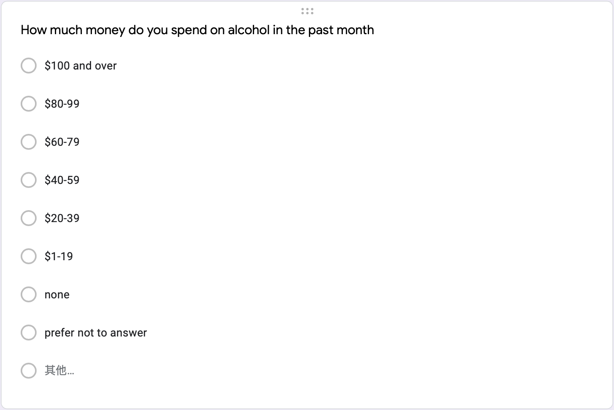
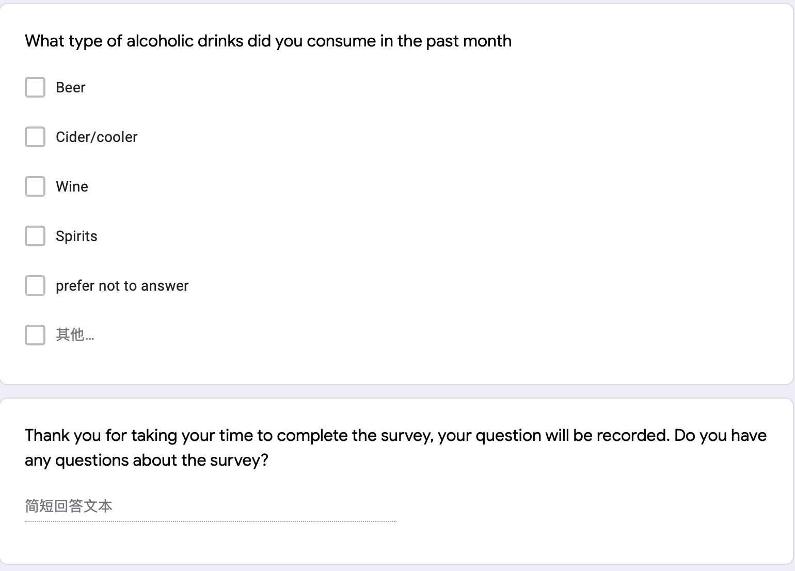

```{r setup, include=FALSE}
library(tidyverse)
library(dplyr)
library(ggplot2)
library(knitr)
library(tidytext)
library(lmtest)
```

# Introduction

The use of alcohol, cigarettes, cannabis, and other drugs has increased in recent years raised people’s concerns. The paper intends to study the factors that influenced individual alcohol consumption in Canada. We imported the data from the 2016 General Social Survey (GSS). Specifically, we focused on the relationship between alcohol consumption and gender, age, education level. We predicted males, older, and low-educated individuals consume more alcoholic drinks.

The paper includes three main sections:\@ref(data), \@ref(results) and \@ref(discussion). In \@ref(data), we cleaned the dataset and only included the variables we needed. We perform exploratory data analysis (EDA) for each variable along with linear regression models. In \@ref(results), We found respondents drank 2-3 times alcohol in a month. Males consumed 0.468995 more alcohol than females on average. Finally, we discussed the weakness of the survey design. To improve, we included additional survey questions with Google form. 

It is important to hold such a study since it can help us know more about alcohol consumption behaviors in society. The findings can also help with studying the personal motives for drinking and increase the persuasiveness of the relevant alcohol research. Last but not least, provide a pathway for prevention and treatment efforts.

# Data

## Data Source

The GSS program designed the telephone survey among the ten provinces of Canada to collect cross-sectional data for trend analysis [@gss]. There are two principal objectives of the program 1) provide background information, estimate the social trends from the data, and predict Canadian’s living conditions and well-being over time 2) include the information about the social policy problems [@gss]. To meet the goals, the GSS dataset contains 1) core contents, which are the social change regarding living conditions and well-being, could be used to estimate the effectiveness of specific policy 2) classification variables such as gender, age, and income which can identify the population groups [@gss].

## Methodology and Data Collection

The 2016 GSS on Canadians at Home and Work was collected between 2016.8.2-2016.12.23 [@gss]. The population of the data frame consisted of all the non-full-time institutional people who were over or equal to 15 years old in Canada, excluding the Yukon, Northwest Territories, and Nunavut residents [@gss]. Aiming to find the sample, the researchers divided ten provinces into different geographic areas. Numerous of the Census Metropolitan Areas (CMAs) such as Toronto, Montreal, Quebec City, Ottawa, Vancouver was considered as separated strata [@gss]. The rest of the CMAs were grouped into three strata [@gss]. The non-CMAs were grouped into 27 strata [@gss]. The sample was randomly selected by household telephone number. Their telephone information was collected by two components, including 1) a list of the phone number (landline and cellular) from a new frame that created by statistics Canada in 2013, and 2) the address register (AR) which refers to a list of addresses among the ten provinces [@gss]. The AR combines all the telephone numbers with the significant address [@gss]. When multiple phone numbers were associated with one address, the primary phone number would be considered the best response phone number [@gss]. The selected respondents need to have a telephone and at least one person who was 15 years of age or older in the household to be considered eligible [@gss]. To determine the eligibility, the respondents need to answer several questions before the survey [@gss]. Then respondents can decide to complete the survey by either electronic questionnaires (EQ) or phone interviews (CATI) [@gss]. The interviews were conducted from 9:00 a.m. - 9:30 p.m. from Mondays to Fridays, 10:00 a.m. to 5:00 p.m. on Saturdays, and 1:00 p.m. to 9:00 p.m on Sundays, in the five Statistics Canada offices: Halifax, Sherbrooke, Sturgeon Falls, Winnipeg, and Edmonton [@gss]. The interviewers would introduce the interview and randomly ask one of the members in the household to answer the questions [@gss]. If the respondents refuse to participate in the survey, the interviewers would explain the interview again to encourage them to participate [@gss].

## Data Characteristics

The paper was written by the **R** statistical language [@citer], the packages of **tidyverse** [@tidyverse] and **dplyr** [@dplyr]. **RMarkdom** [@rmarkdown] and **bookdown** [@bookdown] were used to output the results. The bar plots were created by **ggplot2** [@ggplot2] and tables were created by [@knitr] and **tidy** function from [@tidytext]. We used the ANOVA test to choose the most appropriate model to estimate the relationship between drink and the predictor variables.

Overall, the dataset included 19,609 observations and various variables. The dataset is accessible at the GSS dataset through the UofT library. The dataset was in CSV format, we only downloaded demographic and household composition derived variables; drinking; education highest degree block v.3. We imported the dataset with **read_csv** function and saved later with **write_csv** function. In the cleaning process, we first created a new data frame called *df*. Since we intended to find how gender, age, and education levels influenced respondents’ alcohol consumption. We used the **select** function to select the variables (CASEID, sex,  agegr10, ehg3_01, drr_110) that we are interested in analyzing. Sex refers to the gender of respondents, agegr10 refers to the age group of respondents,  ehg3_01 refers to the highest education levels of respondents, and drr_110 refers to alcohol consumption of respondents in the past month. We used use **rename** function to rename “CASEID” as “id”, “agegr10” as “age”, “ehg3_01” as “edu”, “drr_110” as “drink”. Then we created another new data frame called *df1* that we mutated the variables from double numbers into categorical as follows regarding the codebook [@codebook]. It is more convenient for us to plot the data:

$sex$ = male ~ 1,
      = female ~ 2,
      = valid skip ~ 6,
      = don’t know ~ 7,
      = refusal ~ 8,
      = not stated ~ 9
           
$age$ = 15-24 ~ 1,
      = 25-34 ~ 2,
      = 35-44 ~ 3,
      = 45-54 ~ 4,
      = 55-64 ~ 5,
      = 65-74 ~ 6,
      = valid skip ~ 96,
      = don’t know ~ 97,
      = refusal ~ 98,
      = not stated ~ 99
      
$edu$ = less than high school diploma ~ 1,
      = high school diploma ~  2,
      = trade certificate ~ 3,
      = college diploma ~ 4,
      = university diploma below bachelor's degree ~ 5,
      = bachelor’s degree ~ 6,
      = university diploma above bachelor's degree ~ 7,
      = valid skip ~ 96,
      = don’t know ~ 97,
      = refusal ~ 98,
      = not stated ~ 99
      
$drink$ = everyday ~ 1,
        = 4-6 times a week ~ 2,
        = 2-3 times a week ~ 3,
        = once a week ~ 4,
        = once or twice in the past month ~ 5,
        = not in the past month ~ 6,
        = never drink ~ 7,
        = valid skip ~ 96,
        = don’t know ~ 97,
        = refusal ~ 98,
        = not stated ~ 99

```{r load data, echo = FALSE, message = FALSE, warning = FALSE}
# import raw dataset
raw_df <- read_csv("AACos3du.csv")
```

```{r, echo = FALSE, message = FALSE, warning = FALSE}
# cleaning process  
df <- raw_df %>% 
  select(CASEID, sex, agegr10, ehg3_01 , drr_110) %>% 
  rename(id = CASEID, 
         age = agegr10, 
         edu = ehg3_01,
         drink = drr_110) 
write_csv(df, "df.csv")

df1 <- df %>% 
  mutate(sex = case_when(sex == 1 ~ "male",
                         sex == 2 ~ "female",
                         sex == 6 ~ "valid skip",
                         sex == 7 ~ "don't know",
                         sex == 8 ~ "refusal",
                         sex == 9 ~ "not stated"),
         age = case_when(age == 1 ~ "15-24",
                         age == 2 ~ "25-34",
                         age == 3 ~ "35-44",
                         age == 4 ~ "45-54",
                         age == 5 ~ "55-64",
                         age == 6 ~ "65-74",
                         age == 7 ~ "75&over",
                         age== 96 ~ "valid skip",
                         age == 97 ~ "don't know",
                         age == 98 ~ "refusal",
                         age == 99 ~ "not stated"),
         edu = case_when(edu == 1 ~ "less than high school diploma",
                         edu == 2 ~ "high school diploma",
                         edu == 3 ~ "trade certificate",
                         edu == 4 ~ "college diploma",
                         edu == 5 ~ "university diploma below bachelor's degree",
                         edu == 6 ~ "bachelor's degree ",
                         edu == 7 ~ "university diploma above bachelor's degree",
                         edu == 96 ~ "valid skip",
                         edu == 97 ~ "don't know",
                         edu == 98 ~ "refusal",
                         edu == 99 ~ "not stated"),
         drink = case_when(drink == 1 ~ "everyday",
                           drink == 2 ~ "4-6 times a week",
                           drink == 3 ~ "2-3 times a week",
                           drink == 4 ~ "once a week",
                           drink == 5 ~ "once or twice in the past month",
                           drink == 6 ~ "not in the past month",
                           drink == 7 ~ "never drink",
                           drink == 96 ~ "valid skip",
                           drink == 97 ~ "don't know",
                           drink == 98 ~ "refusal",
                           drink == 99 ~ "not stated"))
write_csv(df1, "df1.csv")                           
```

\newpage

## Figures

Figure 1-4 demonstrates the distributions of the selected variables. Figure 1 displays the distribution of survey respondents' sex. The female and male respondents were around 10,000 and 8,000, respectively.
Our results of respondents' age, grouped by 10 in figure 2 followed a normal distribution. The plot is left-skewed where the mode falls into the 55-64 years of the age column. 4,040 respondents were at the age of 55-64 years. Figure 3 indicates the distributions of respondents' highest education level. Most respondents had a high school diploma (4,739), followed by a college certificate and bachelor's degree diploma. Figure 4 answered the question of "how often did you drink alcoholic beverages in the past months?" The options included from every day, 4-6 times a week, 2-3 times a week, once a week, once or twice in the past month, not in the past month, never drink, etc. There were 4,712; 3,145; 3,117 respondents who claimed they drink once or twice in the past month, not in the past month, and 2-3 times a week, respectively.  

The results of Figures 5-7 explore the factors that affect the respondents' alcohol consumption. For example, does male/older/higher education respondents consume more alcohol than female/younger/low education respondents? Figure 5 illustrates respondents' alcohol consumption grouped by gender. We observed the female respondents' alcohol consumption is slightly higher than males except for the everyday column. Gender may be the factor that affects drinking, but further analysis is needed. Since the reason might be the number of females is higher than the male. The results of figure 6 show the distribution of alcoholic drinks consumption grouped by age. We could see that alcohol consumption among the different age groups is most likely the same. The group of 15-24 years of age consumed less than other groups. We believe the reason might be the minimum legal drinking age in Alberta, Manitoba, and Quebec is 18 years old; and 19 years old in the rest of the provinces and territories in Canada. Figure 7 displays the consumption of alcoholic beverages grouped by highest education level. We noticed the frequency of high school diploma respondents consuming drinks is generally higher than other education level respondents. And the frequency of university diplomas below bachelor's degree, in general, is lower than other education level respondents. The respondents who have less than a high school level prefer never to drink.


```{r fig1,  fig.cap = 'Distribution of survey respondents gender', fig.width = 10, fig.height = 6, warning = FALSE, message = FALSE, echo = FALSE}
#EDA
df1 %>% 
  ggplot(aes(x=sex))+
  geom_bar(color = "dodgerblue", fill = "dodgerblue", alpha = 0.8)+
  theme_minimal()+
  labs(title = "Survey respondents's gender")
```


```{r fig2,  fig.cap = 'Distribution of survey respondents age, group by 10', fig.width = 10, fig.height = 6, warning = FALSE, message = FALSE, echo = FALSE}
#EDA
df1 %>% 
  ggplot(aes(x=age))+
  geom_bar(color = "lightgreen", fill = "lightgreen", alpha = 0.8)+
  theme_minimal()+
  labs(title = "Survey respondents's age")
```


```{r fig3,  fig.cap = 'Distribution of survey respondents highest education level', fig.width = 10, fig.height = 6, warning = FALSE, message = FALSE, echo = FALSE}
#EDA
df1 %>% 
  ggplot(aes(x=edu))+
  geom_bar(color = "indianred", fill = "indianred", alpha = 0.8)+
  theme_minimal()+
  coord_flip()+
  labs(title = "Survey respondents's highest education level")
```


```{r fig4,  fig.cap = 'Distribution of survey respondents alcohol consumption', fig.width = 10, fig.height = 6, warning = FALSE, message = FALSE, echo = FALSE}
#EDA
df1 %>% 
  ggplot(aes(x=drink))+
  geom_bar(color = "blueviolet", fill = "blueviolet", alpha = 0.8)+
  theme_minimal()+
  coord_flip()+
  labs(title = "Survey respondents's alcohol consumption")
```


```{r fig5,  fig.cap = 'Survey respondents alcoholic beverages consumption in the past month by gender group', fig.width = 10, fig.height = 6, warning = FALSE, message = FALSE, echo = FALSE}
#EDA
df1 %>% 
  ggplot(aes(x=drink, fill = sex))+
  geom_bar(alpha = 0.9)+
  theme_minimal()+
  coord_flip()+
  labs(x = "alcohol consumption", title = "Survey respondents's alcohol consumption by gender group")

```


```{r fig6,  fig.cap = 'Survey respondents alcoholic beverages consumption in the past month by age group', fig.width = 10, fig.height = 6, warning = FALSE, message = FALSE, echo = FALSE}
#EDA
df1 %>% 
  ggplot(aes(x=drink, fill = age))+
  geom_bar(alpha = 0.9)+
  theme_minimal()+
  coord_flip()+
  labs(x = "alcohol consumption", title = "Survey respondents's alcohol consumption by age" )
```


```{r fig7,  fig.cap = 'Survey respondents alcoholic beverages consumption in the past month by education level', fig.width = 10, fig.height = 6, warning = FALSE, message = FALSE, echo = FALSE}
#EDA
df1 %>% 
  ggplot(aes(x=drink, fill = edu))+
  geom_bar(alpha = 0.9)+
  theme_minimal()+
  coord_flip()+
  scale_fill_brewer(palette="Set3")+
  labs(x = "alcohol consumption", fill = "education level", title = "Survey respondents's alcohol consumption by education" )
```


## Models

The model is shown below which consist with three all explanatory variables (sex, age, highest education level) and the response variable is the alcoholic drink consumption. 

$$y_{idrink} = \beta_0 + \beta_{1}sex + \beta_{2}age + \beta_{3}edu + \epsilon_i$$

 - $y_{idrink}$ is survey respondents' alcohol consumption (in the past month) 
 - $\beta_0$ is the grand mean of alcohol consumption in the past month
 - $\beta_sex$ are fixed effects for respondents' sex
 - $\beta_age$ are fixed effects for respondents' age
 - $\beta_edu$ are fixed effects for respondents' highest education level
 - $\epsilon_{i}$ is the error term that $\epsilon_{i}\sim N(0, \sigma^2)$


# Results

The models were conducted with *df* dataset and **lm** function. mod1 is the full model, mod2 contains with two explanatory variables (sex, higest education level), and mod3 only included variable of sex. We applied the **ANOVA** test between mod2 and mod3; mod2 and mod1, to see which model is the most appropriate.

```{r, warning = FALSE, message = FALSE, include= FALSE}
mod1  <- lm(drink ~ sex+ age + edu, data = df)
mod2 <- lm(drink ~ sex+ edu, data = df)
mod3 <- lm(drink ~ sex, data = df)
```


```{r, warning = FALSE, message = FALSE, echo = FALSE}
knitr::kable(tidy(mod1), caption = "Summary table for mod1")
```


```{r, warning = FALSE, message = FALSE, echo = FALSE}
knitr::kable(tidy(mod2), caption = "Summary table for mod2")
```


```{r, warning = FALSE, message = FALSE, echo = FALSE}
knitr::kable(tidy(mod3), caption = "Summary table for mod3")
```


```{r, warning = FALSE, message = FALSE, echo = FALSE}
tibble(anova(mod2, mod3)) %>% 
  knitr::kable(caption = "The anova test between mod2 and mod3")

tibble(anova(mod2, mod1)) %>% 
  knitr::kable(caption = "The anova test between mod2 and mod1")
```


After applying ANOVA test, we chose mod2 is the most appropriate model. The p value between mod2 and mod3 is < 2e-16 which is less than 0.05; the p value between mod2 and mod1 is 0.1298963. The small p value means that we have strong evidence to against the null hypothesis that there is no difference between simpler model and more complex model. Thus, we think the education term is significant but age is not. The final model is mod2 as shown below:

\begin{equation}
y_idrink = 3.033915 +  0.468995sex + 0.251926edu + 5.476 (\#eq:linear)
\end{equation}

Equation \@ref(eq:linear) shows the average of respondents' alcoholic beverages consumption in the past month is 3.033915 (2-3 times a week). An 0.468995 increase in alcohol consumption when the sex is male. An 0.251926 increase in alcohol consumption when education level is higher. The standard error of residual is 5.476.


# Discussion

## First discussion point

In the paper, we conducted EDA to find the distribution of sex, age, education level, alcoholic drinking consumption as well as grouped by these three variables. Moreover, we conduct three linear regression models using alcoholic consumption as response variables and the rest were predicted variables. 

## Second discussion point

The 2016 GSS on Canadians at Home and Work illustrates the proportion of female respondents was slightly higher than males. The distribution of respondents' age indicates the aging population issue in Canadian society. Another statistic report from Statista depicted 15.9%, 67.65%, and 16.46% of the overall population in Canada were 0-14 years of age, 15-64 years of age, and over 65 years of age, respectively in 2016 [@Statista]. The proportion over 65 years of age increasing in recent years and reached 18.1% in 2020 [@Statista]. The distribution of highest education level depicts the proportion of high school diploma is the highest. Other researches pointed out that over 54% of Canadians aged 25-64 years had either a university or college diploma in 2016 [@education]. The alcohol consumption distribution indicates most respondents reported they drink once or twice in the past month, followed by 2-3 times a week, not in the past month, and never drink. Figures 5-7 predict the relationship between alcoholic beverages consumption and sex, age, highest education level. The model we chose proved individual sex and highest education level positively correlated to alcohol consumption.

## Third discussion point

There is some relevant research that studied alcohol consumption. The researchers created an informal survey, including the question to ask how many alcoholic drinks did you consume last weekend [@regression]. Similarly, they fitted generalized (Poisson) regression models with predict variables off campus (the students live on campus or off campus) and sex [@regression]. They found off-campus students' alcohol consumption is 0.8976 higher than on campus [@regression]. Also, males' alcohol consumption is 1.1154 higher than females [@regression]. 

Besides, we should consider including other factors that affect alcoholic consumption such as income, ethnicity, and mental health disorders. For example, publications of the government of Canada reported that increased alcohol consumption with income and specifically significant performance in males. 3.5 times higher among white Canadians than among South Asian, East/Southeast Asian, and Arab/West Asian Canadians [@income]. 

## Weaknesses and next steps

There were some limitations in the survey. First, the survey only required one person from each selected household to complete the questions. Bias may exist because the respondents cannot represent the opinions of other family members. Second, the options for the survey questions could be further refined. For example, the options of sex questions can also include transgender, gender-neutral, non-binary, agender, and so on. Therefore, we include an additional survey link in the \@ref(appendix).

\newpage

\appendix

# Appendix {-}

## Supplementary survey
Our supplementary survey is available here: https://forms.gle/f7f4mBsjq5QVU4as8









Thank you for your participation!


\newpage


# References


